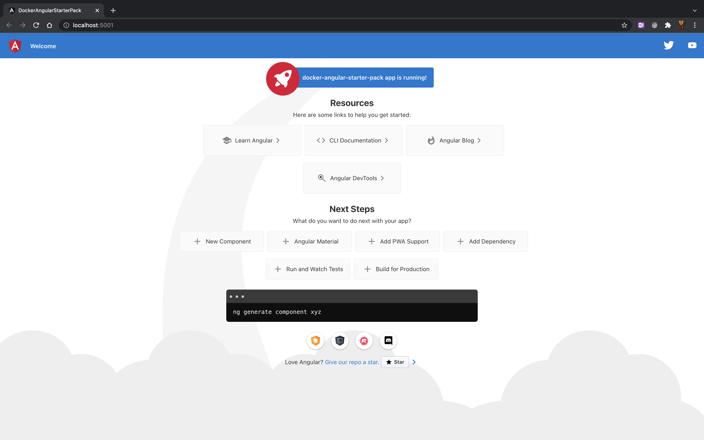
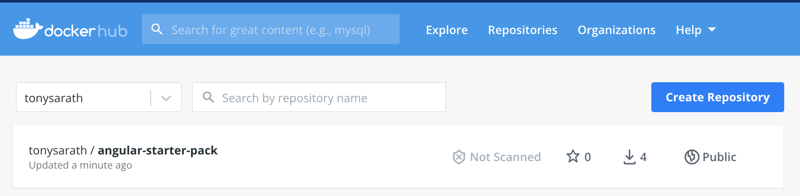
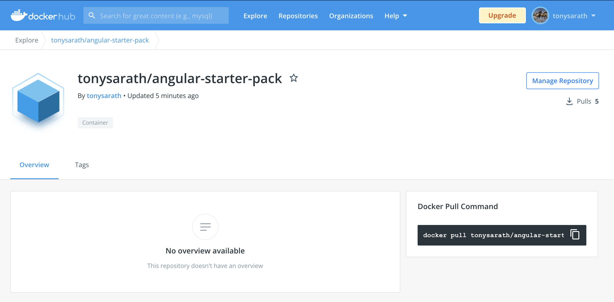
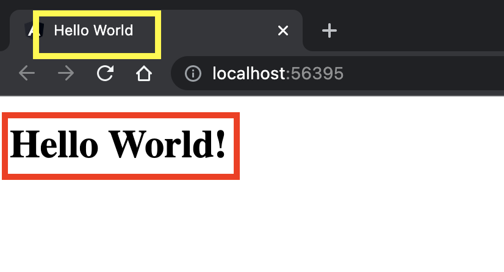
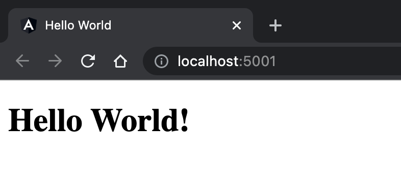

# DockerAngularStarterPack

This project was generated with [Angular CLI](https://github.com/angular/angular-cli) version 13.0.1.

## Development server

Run `ng serve` for a dev server. Navigate to `http://localhost:4200/`. The app will automatically reload if you change any of the source files.

## Code scaffolding

Run `ng generate component component-name` to generate a new component. You can also use `ng generate directive|pipe|service|class|guard|interface|enum|module`.

## Build

Run `ng build` to build the project. The build artifacts will be stored in the `dist/` directory.

## Running unit tests

Run `ng test` to execute the unit tests via [Karma](https://karma-runner.github.io).

## Running end-to-end tests

Run `ng e2e` to execute the end-to-end tests via a platform of your choice. To use this command, you need to first add a package that implements end-to-end testing capabilities.

## Further help

To get more help on the Angular CLI use `ng help` or go check out the [Angular CLI Overview and Command Reference](https://angular.io/cli) page.

---

# Start Dockerized

- create `Dockerfile` in the root folder of project
```dockerfile
#stage 1
FROM node:latest as build
WORKDIR /app
COPY . .
RUN npm install
RUN npm run build --prod
#stage 2
FROM nginx:alpine
COPY --from=build /app/dist/docker-angular-starter-pack /usr/share/nginx/html
```
- there are 2 stage in the `Dockerfile`
- stage 1: build, mean it will run `node` container to build our angular project into `./dist/` folder with the application name as package
- Ex: in this case, I name my application as `docker-angular-starter-pack` so the package path will be `./dist/docker-angular-starter-pack`
- stage 2: deploy application into docker image, this will copy the build package `docker-angular-starter-pack` into nginx root path and build new image
- Now let start to build it
```shell
docker build -t tonysarath/angular-starter-pack:latest .
```
- `tonysarath` is my docker hub account
- `angular-starter-pack` will be the image name
- `:latest` is the tag
- now show the image in my local machine
```shell
docker image ls
```
```shell
# output
REPOSITORY                                                        TAG       IMAGE ID       CREATED         SIZE
tonysarath/angular-starter-pack                                   latest    f7155d0dc74d   2 minutes ago   23.4MB
```
- let run this container test if it works
- by default nginx will expose port 80, now I will NAT port 5000 of my localhost into port 80 of container 
```shell
docker run -d -p 5001:80 --name angular-starter-pack tonysarath/angular-starter-pack
```
```shell
# output
2fa9b0023825d1a542c41908cec17da409a833d45072459a5410368a2dcd35c1
```
- check the docker process
```shell
docker ps
```
```shell
# output
CONTAINER ID   IMAGE                             COMMAND                  CREATED         STATUS         PORTS                  NAMES
2fa9b0023825   tonysarath/angular-starter-pack   "/docker-entrypoint.…"   9 seconds ago   Up 8 seconds   0.0.0.0:5001->80/tcp   angular-starter-pack
```
- start access the web application http://localhost:5001
```shell
open http://localhost:5001
```

# Push docker image to docker hub
- login to your docker hub account
```shell
docker login
```
- because I used to authenticated so it will my tokens
```shell
# output
Authenticating with existing credentials...
Login Succeeded

Logging in with your password grants your terminal complete access to your account. 
For better security, log in with a limited-privilege personal access token. Learn more at https://docs.docker.com/go/access-tokens/
```
- now push
```shell
docker push tonysarath/angular-starter-pack:latest
```
```shell
# output
The push refers to repository [docker.io/tonysarath/angular-starter-pack]
b643da88d51f: Pushed 
3d71b657b020: Mounted from library/nginx 
eabae5075c43: Mounted from library/nginx 
385374b911f2: Mounted from library/nginx 
5af959103b90: Mounted from library/nginx 
ad93babfd60c: Mounted from library/nginx 
1a058d5342cc: Mounted from library/nginx 
latest: digest: sha256:78ebfe2a5936029bf880bf52e4eb1f74d665ad378283326266409b5fea90a9dc size: 1777
```
- now check on docker hub
- here we [go](https://hub.docker.com/repository/docker/tonysarath/angular-starter-pack)



---

# Update the changes

- let say we update something in our application, and to get the container up-to-date, we need to re-build image
- then stop the current running container
- and run container again with new image tag
- in this example, I will clean the default angular page to just `Hello World!`
- let start:
- so I changed the page title of this file `src/index.html`
- and changed content of this file `src/app/app.component.html`
- the result of application turn to this

- now build image and run the container
```shell
docker stop angular-starter-pack # stop current running container
docker container rm angular-starter-pack # remove current container
docker build -t tonysarath/angular-starter-pack:latest . # build new image
docker run -d -p 5001:80 --name angular-starter-pack tonysarath/angular-starter-pack:latest # run container again from new image
open http://localhost:5001 # access our application
```

- of course, we can always push our new image to docker hub.
```shell
docker push tonysarath/angular-starter-pack:latest
```
